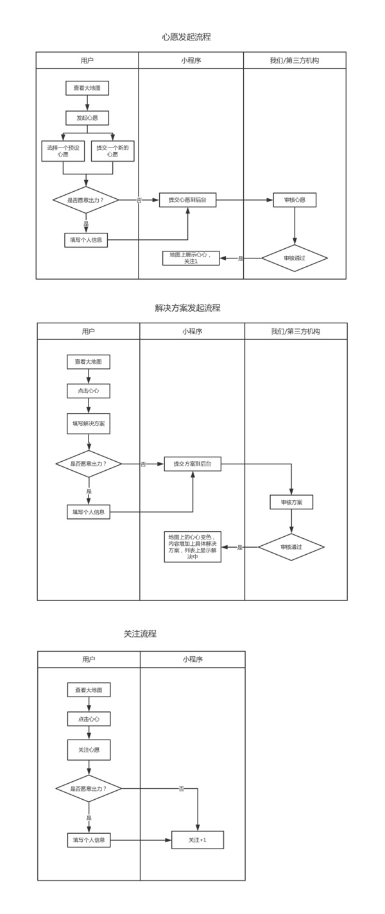
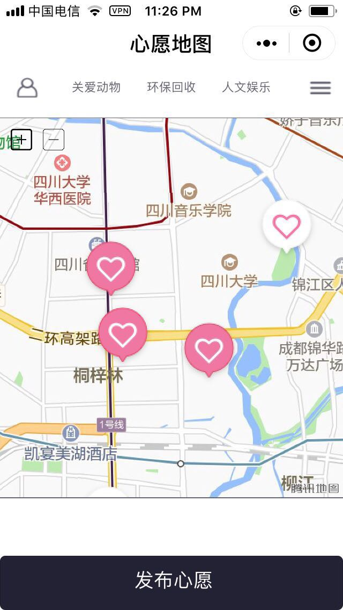
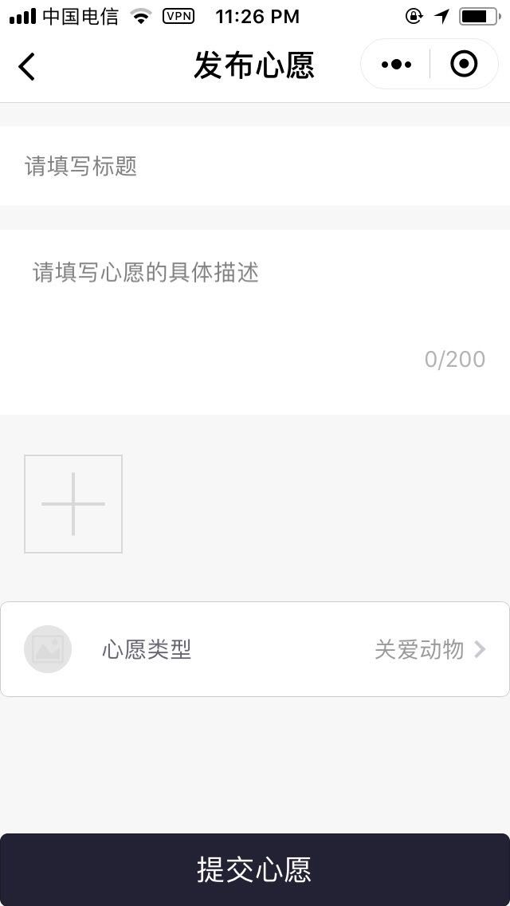
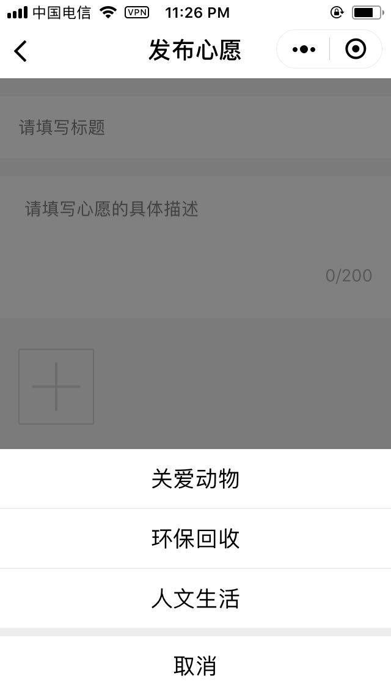
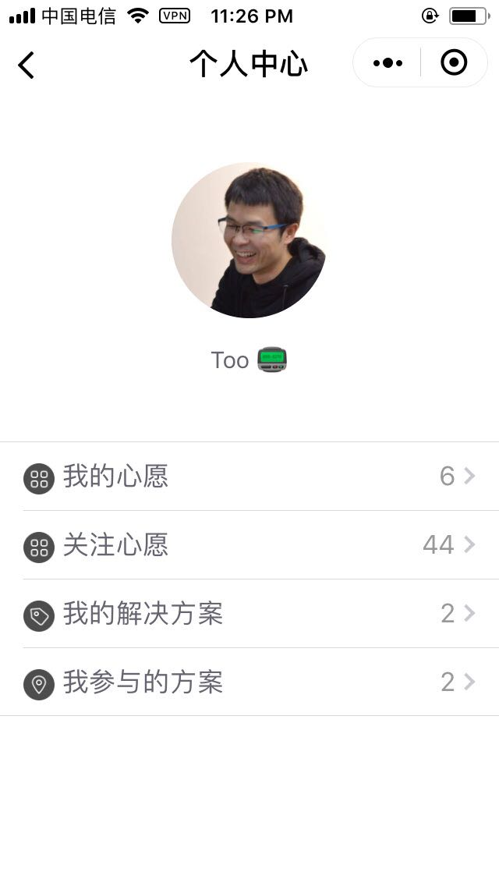
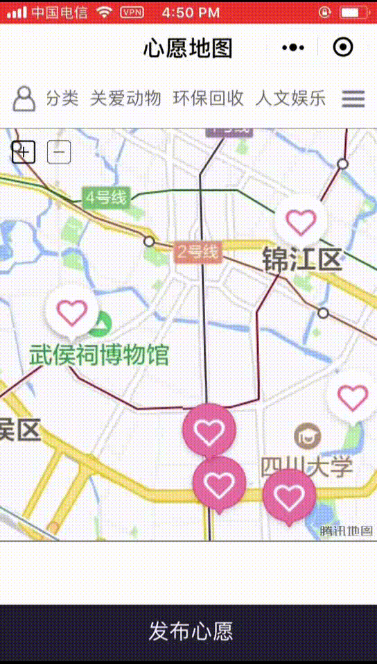

# 微信小程序小区心愿地图
## 参赛说明
本项目是参加 FCC 成都社区举行的 [2018 黑客松比赛](https://fcc.hackerearth.com/zh/)

## 项目功能和设计说明
### 概要
项目主要目标是通过微信小程序来提供一个便捷收集生活中小心愿的渠道，希望能通过以小区为集合点，收集愿望、展现需求、集结有想法和行动的人，让我们实现更美好的生活心愿（做60分到100分的生活质量提升）

### 前期用户调查
我们对身边的朋友进行了一个简单的调查，发现日常生活中大家比较关心的主要有三大类问题：
1. 关爱动物：文明养犬 流浪猫狗救助
2. 环保回收：垃圾分类 旧物回收改造
3. 人文娱乐：流动图书馆 阅读推广 生活社群共建

### 功能设计
因此我们设计的小程序主要围绕这三个问题来提供一个平台给用户进行心愿发布、关注心愿（可表达参与解决意向）、提供解决问题的可选方案（对如何解决问题进行建议）、选择解决方案和一起行动。初步的流程图设计如下：



### 具体功能实现
#### 地图心愿的展示

#### 用户发布心愿

#### 选择类别

#### 个人中心


#### 演示发布心愿

GIF 无法显示请查看 [Youku 视频](http://v.youku.com/v_show/id_XMzMyMzc0ODU2OA==.html)

## 框架
- wepy 1.6.0
- weui-wxss 1.1.1
## 开发方式
#### 安装（更新） wepy 命令行工具。
```console
npm install wepy-cli -g
```
#### clone 项目
```
    git clone  https://github.com/cfc2018/wx-cdWant.git
    cd wx-cdWant
    npm install
```

#### 开发实时编译

```console
wepy build --watch
```
#### 安装微信调试工具
https://mp.weixin.qq.com/debug/wxadoc/dev/devtools/download.html?t=1515507318

#### 设置微信调试工具

1. 使用`微信开发者工具`新建项目，本地开发选择`dist`目录。

2. `微信开发者工具`-->项目-->关闭ES6转ES5。<font style="color:red">重要：漏掉此项会运行报错。</font>

3. `微信开发者工具`-->项目-->关闭上传代码时样式自动补全 <font style="color:red">重要：某些情况下漏掉此项会也会运行报错。</font>

4. `微信开发者工具`-->项目-->关闭代码压缩上传 <font style="color:red">重要：开启后，会导致真机computed, props.sync 等等属性失效。[#270](https://github.com/wepyjs/wepy/issues/270)</font>

5. 项目根目录运行`wepy build --watch`，开启实时编译。

   ​


